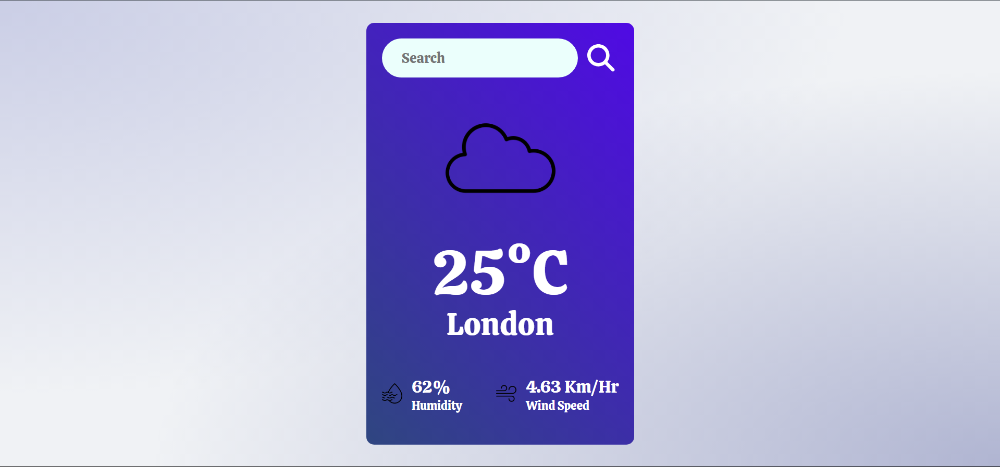

# Weather App

A React-based weather application that fetches and displays current weather data for any city using the OpenWeatherMap API.

## Live Demo

Check out the live demo of the application: [MarxWeather](https://marxweather.vercel.app/)

## Features

- Search for current weather data by city name.
- Display weather details including temperature, humidity, wind speed, and weather icon.
- Automatically fetch weather data for London on the initial load.
- Responsive design for optimal viewing on various devices.
- Alert system for invalid input or errors during data fetching.

## Screenshots



## Getting Started

Follow these instructions to set up the project on your local machine for development and testing.

### Prerequisites

- Node.js and npm installed on your machine. You can download them from [Node.js](https://nodejs.org/).

### Installation

1. Clone the repository:
    ```bash
    git clone https://github.com/abhijithdasane/weather-app.git
    ```

2. Navigate to the project directory:
    ```bash
    cd weather-app
    ```

3. Install the dependencies:
    ```bash
    npm install
    ```

### API Key

This project uses the OpenWeatherMap API. You need to have an API key to fetch the weather data. Follow these steps:

1. Sign up at [OpenWeatherMap](https://home.openweathermap.org/users/sign_up) to get your API key.
2. Create a `.env` file in the root directory of the project and add your API key:
    ```env
    VITE_API_KEY=your_api_key_here
    ```

### Running the Application

1. Start the development server:
    ```bash
    npm run dev
    ```

2. Open your browser and navigate to `http://localhost:3000` to see the application in action.

## Project Structure

weather-app/
│
├── public/
│ └── index.html
│
├── src/
│ ├── assets/
│ │ ├── cloud.png
│ │ ├── sun.png
│ │ ├── moon.png
│ │ ├── drizzle.png
│ │ ├── rain.png
│ │ ├── snowfall.png
│ │ └── wind.png
│ │
│ ├── components/
│ │ └── Weather.jsx
│ │
│ ├── App.css
│ ├── App.jsx
│ ├── index.css
│ └── main.jsx
│
├── .env
├── .gitignore
├── README.md
├── package-lock.json
└── package.json


## Deployment

This project is deployed using [Vercel](https://vercel.com/). To deploy your own version:

1. Push your code to a GitHub repository.
2. Sign in to Vercel and import your repository.
3. Follow the deployment instructions provided by Vercel.

## Contributing

Contributions are welcome! Please follow these steps:

1. Fork the repository.
2. Create a new branch (`git checkout -b feature/your-feature`).
3. Commit your changes (`git commit -m 'Add some feature'`).
4. Push to the branch (`git push origin feature/your-feature`).
5. Open a pull request.

## License

This project is licensed under the MIT License.

## Acknowledgments

- Icons from [IconFinder](https://www.iconfinder.com/)
- Weather data from [OpenWeatherMap](https://openweathermap.org/)

